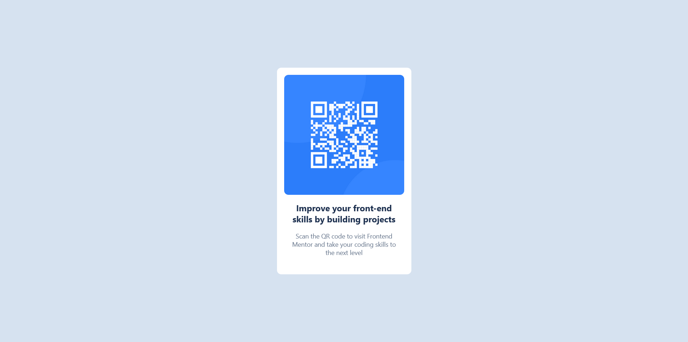

# QR Code Component

A simple and responsive QR code card built with HTML and CSS.

## Preview

  

  

## About The Project

This project was created as a Frontend Mentor challenge.  
The goal was to practice basic frontend development skills such as:

- HTML structure
- CSS styling
- Flexbox
- Responsive design
- Centering elements

## Built With

- HTML5
- CSS3
- Flexbox
